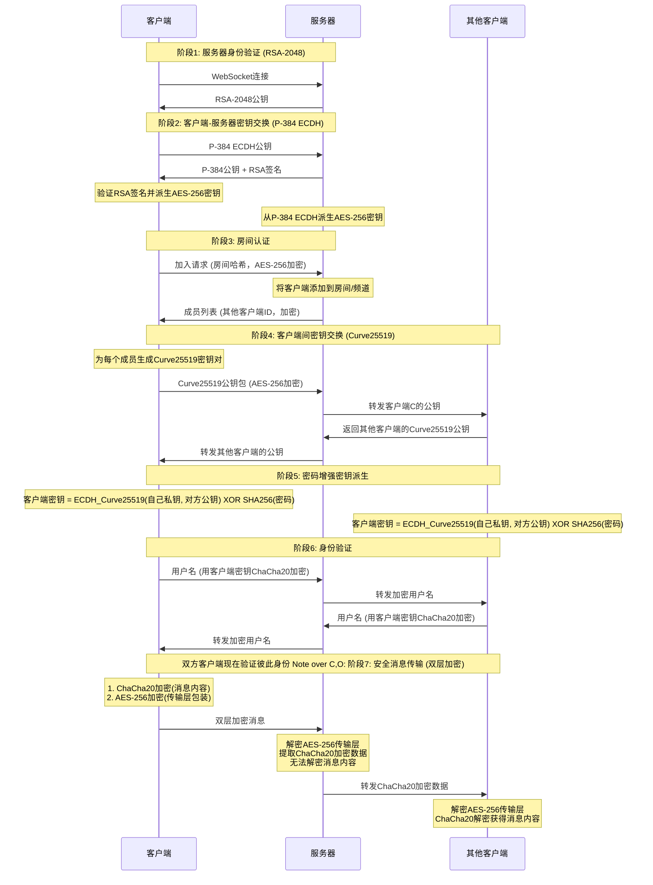

# NodeCrypt

🌐 **[English README](README_EN.md)**

## Windows 轻量桌面版（推荐）

每台局域网电脑运行同一个 `NodeCrypt-Desktop.exe`，无需 Node.js、外部浏览器或独立数据库。程序使用 Go + Wails + 系统 WebView2，当前构建产物约 15 MB，比 Electron 更轻量。

```powershell
npm ci
npm run build:desktop
```

产物位于 `release/NodeCrypt-Desktop.exe`。将它发给局域网内的每名用户，双击启动并在 Windows 防火墙提示中允许“专用网络”。程序会通过 UDP 组播自动发现其他 NodeCrypt 节点；发现页同时显示本机局域网 IPv4，并可手动输入 `IP`、`IP:端口` 或完整房间分享链接。只输入 IP 时默认使用端口 `8788`。聊天双方选择同一个节点后，直接输入用户名、房间名和房间密码即可进入，不需要注册或登录账号。

每个桌面程序都内置 HTTP/WebSocket 聊天节点和 SQLite。群聊文本、图片和文件分卷会同时保存到当前聊天节点和每名在线桌面用户自己的 `%APPDATA%\NodeCrypt Desktop\nodecrypt.sqlite`；重新进入相同房间时，即使改选了另一台聊天节点，本机记录也会合并显示并可重新下载完整文件。同名无密码房间和同名有密码房间使用独立的历史分区与在线成员通道。聊天正文和文件分卷在客户端加密，数据库只保存密文；私聊消息及私聊文件仍只存在于当前会话。读取记录必须使用完全相同的房间名和房间密码，用户名可以不同，但同一房间内的在线用户名不能重复。当前 Windows 10/11 通常已包含所需的 Microsoft Edge WebView2 Runtime。

桌面发现页保留最近 12 个房间，可显示节点、房间名和用户名并快捷重进。房间密码使用 Windows DPAPI 加密，只能由保存它的 Windows 用户解密，不会以明文写入 `desktop.json`。

通过局域网 IP 在浏览器中访问时，浏览器自身不需要 SQLite：它从所连接 EXE 节点的 SQLite 请求客户端密文历史，并在浏览器中使用房间密码解密。通过 EXE 进入时会合并读取该节点历史和本机 SQLite；首次使用的新电脑本机库为空，但仍能取得在线节点保存的历史。节点离线后，浏览器无法取得该节点历史，已安装 EXE 的用户仍可读取自己此前同步到本机的记录。

这个版本仍采用“共享节点盲中继”模型，不是无服务器的纯 P2P：双方可以自动发现彼此，但实时聊天时必须连接同一个在线节点。节点所在电脑退出程序后，该节点暂时不可用；每台电脑的本机历史仍可读取。需要迁移本机数据时备份整个 `%APPDATA%\NodeCrypt Desktop` 目录。

不需要关闭 Windows 防火墙。Windows 10/11 桌面版优先通过系统 `Dnscache` 的 DNS-SD/mDNS 服务发现 `_nodecrypt._tcp.local`，并保留 UDP `42429` 与手动 IP 作为兼容兜底。发现页会显示规则状态、端口、范围和绑定的 EXE 路径，并提供添加/更新和删除操作。用户确认 UAC 后，程序仅管理 TCP `8788-8807` 和 UDP `42429` 入站规则，远程范围限定为 `LocalSubnet`；程序不会自动关闭防火墙或静默提权。

## Windows 浏览器兼容版

仓库可打包为单个 Windows EXE。最终用户不需要安装 Node.js、npm、Nginx 或数据库：

```powershell
npm ci
npm run build:exe
```

产物位于 `release/NodeCrypt-LAN.exe`。双击后程序会：

- 在 `0.0.0.0:8788` 启动网页、账号 API 和 WebSocket；端口占用时会尝试后续端口。
- 自动打开主机浏览器，并在控制台打印可供其他设备访问的局域网 URL。
- 提供账号注册、登录、退出和登录会话校验；账号密码与房间密码互相独立。
- 在 EXE 旁创建 `NodeCrypt-Data/nodecrypt.sqlite`，保存账号、会话和客户端加密后的群聊历史。

局域网用户只需要用浏览器打开控制台打印的地址，不需要复制 EXE。主机必须保持程序窗口开启，并在 Windows 防火墙提示中允许“专用网络”。备份或迁移时请复制整个 `NodeCrypt-Data` 目录。

当前 EXE 没有商业代码签名证书，Windows SmartScreen 可能显示未知发布者。正式分发前应使用自己的 Authenticode 证书签名。

免部署版默认使用局域网 HTTP，并内置不依赖安全上下文的密码学回退，因此聊天正文仍在客户端加密。但 HTTP 不能保护账号登录请求和服务器身份，只应在可信专用局域网使用，不要把端口映射到公网。公网使用必须配置受信任的 HTTPS 反向代理。

## 🚀 部署说明

### 一键部署到 Cloudflare Workers

点击下方按钮即可一键部署到 Cloudflare Workers：
[](https://deploy.workers.cloudflare.com/?url=https://github.com/shuaiplus/nodecrypt)

- 构建命令：npm run build
- 部署命令：npm run deploy
- 

## 📝 项目简介

NodeCrypt 是一个真正的端到端加密聊天系统，实现完全的零知识架构。整个系统设计确保服务器、网络中间人、甚至系统管理员都无法获取任何明文消息内容。所有加密和解密操作都在客户端本地进行，服务器仅作为加密数据的盲中继。

### 聊天记录

- 群聊文本和图片会在客户端使用房间密码派生的 AES-256-GCM 密钥加密后保存。
- Cloudflare Workers 使用 Durable Object SQLite；Node.js 自托管版默认保存到 `server/data/nodecrypt.sqlite`。
- 服务端仅保存密文，无法读取用户名、消息或图片内容。
- 默认每个房间保留最近 5000 条记录，可通过 `NODECRYPT_HISTORY_LIMIT` 调整 Node.js 自托管版。
- 群聊文件的元数据、压缩分卷和完成标记均以客户端密文保存，可在重新进入后重建下载；私聊消息和私聊文件仍不写入公共历史数据库。

Node.js 自托管版需要 Node.js 22.5 或更高版本。Docker 部署时请挂载数据库目录：

```bash
docker run -d --name nodecrypt -p 80:80 -v nodecrypt-data:/app/server/data ghcr.io/shuaiplus/nodecrypt
```

### 系统架构
- **前端**：ES6+ 模块化 JavaScript，无框架依赖
- **后端**：Cloudflare Workers + Durable Objects
- **通信**：WebSocket 实时双向通信
- **构建**：Vite 现代化构建工具

## 🔐 零知识架构设计

### 核心原则
- **服务器盲转**：服务器永远无法解密消息内容，仅负责加密数据中转
- **密文数据库**：SQLite 仅保存客户端生成的群聊密文，服务器无法解密消息内容
- **端到端加密**：消息从发送方到接收方全程加密，中间任何环节都无法解密
- **临时私聊**：私聊继续使用临时会话密钥，不写入历史数据库
- **匿名通信**：用户无需注册真实身份，支持临时匿名聊天
- **多样体验**：和批量发送图片和文件，可选择主题和语言。

### 隐私保护机制

- **实时成员提醒**：房间在线列表完全透明，内任何人加入或离开都会实时通知所有成员，
- **加密群聊历史**：知道正确房间密码的用户可以解密已保存的群聊记录
- **私聊加密**：点击用户头像可发起端到端加密的私密对话，房间内其他成员完全无法看到私聊内容

### 房间密码机制

房间密码作为**密钥派生因子**参与端到端加密：`最终共享密钥 = ECDH_共享密钥 XOR SHA256(房间密码)`

- **密码错误隔离**：不同密码的房间无法解密彼此的消息
- **服务器盲区**：服务器永远无法获知房间密码

### 三层安全体系

#### 第一层：RSA-2048 服务器身份验证
- 服务器启动时生成临时 RSA-2048 密钥对，每24小时自动轮换
- 客户端连接时验证服务器公钥，防止中间人攻击
- 私钥仅在服务器内存中存在，从不持久化存储

#### 第二层：ECDH-P384 密钥协商
- 每个客户端生成独立的椭圆曲线密钥对（P-384曲线）
- 通过椭圆曲线 Diffie-Hellman 密钥交换协议建立共享密钥
- 每个客户端与服务器之间拥有独立的加密通道

#### 第三层：混合对称加密
- **服务器通信**：使用 AES-256-CBC 加密客户端与服务器间的控制消息
- **客户端通信**：使用 ChaCha20 加密客户端之间的实际聊天内容
- 每条消息使用独立的初始化向量（IV）和随机数（Nonce）

## 🔄 完整加密流程详解




## 🛠️ 技术实现

- **Web Cryptography API**：浏览器原生加密实现，提供硬件加速
- **elliptic.js**：椭圆曲线密码学库，实现 Curve25519 和 P-384
- **aes-js**：纯 JavaScript AES 实现，支持多种模式
- **js-chacha20**：ChaCha20 流加密算法的 JavaScript 实现
- **js-sha256**：SHA-256 哈希算法实现

## 🔬 安全验证

### 加密过程验证
用户可通过浏览器开发者工具观察完整的加密解密过程，验证消息在传输过程中确实处于加密状态。

### 网络流量分析
使用网络抓包工具可以验证所有 WebSocket 传输的数据都是不可读的加密内容。

### 代码安全审计
所有加密相关代码完全开源，使用标准密码学算法，欢迎安全研究者进行独立审计。

## ⚠️ 安全建议

- **使用强房间密码**：房间密码直接影响端到端加密强度，建议使用复杂密码
- **密码保密性**：房间密码一旦泄露，该房间所有通信内容都可能被解密
- **使用最新版本的现代浏览器**：确保密码学API的安全性和性能

## 🤝 安全贡献

欢迎安全研究者报告漏洞和进行安全审计。严重安全问题将在24小时内修复。

## 📄 开源协议

本项目采用 ISC 开源协议。

## ⚠️ 免责声明

本项目仅供学习和技术研究使用，不得用于任何违法犯罪活动。使用者应遵守所在国家和地区的相关法律法规。项目作者不承担因使用本软件而产生的任何法律责任。请在合法合规的前提下使用本项目。

---
## Star History

[](https://www.star-history.com/#shuaiplus/NodeCrypt&Timeline)

**NodeCrypt** - 真正的端到端加密通信 🔐

*"在数字时代，加密是保护隐私的最后一道防线"*
