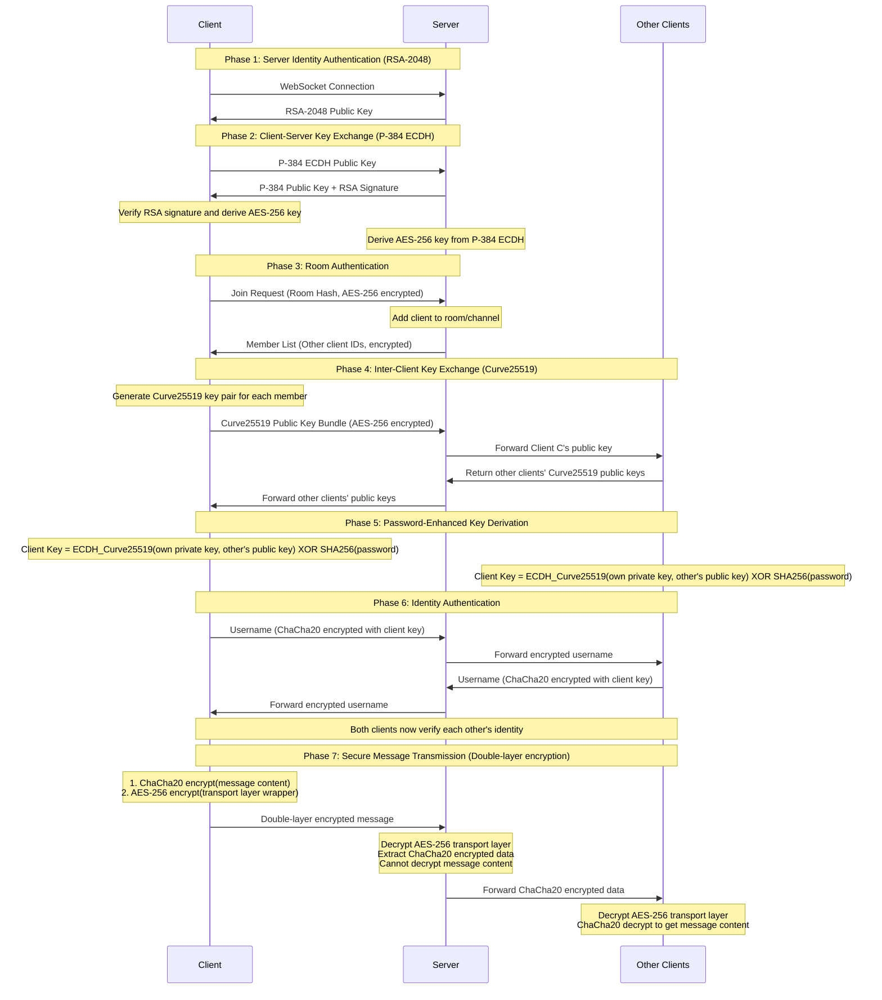

# NodeCrypt

## Lightweight Windows Desktop App (Recommended)

Every LAN user runs the same `NodeCrypt-Desktop.exe`; no Node.js, external browser, or separate database is needed. The app uses Go, Wails, and the system WebView2 runtime. The current executable is about 15 MB, substantially lighter than Electron.

```powershell
npm ci
npm run build:desktop
```

The output is `release/NodeCrypt-Desktop.exe`. Distribute it to every user and allow private-network access when Windows Firewall asks. Each app advertises its embedded node over UDP multicast. The discovery view also shows local IPv4 addresses and accepts an `IP`, `IP:port`, or complete room share link for direct connection; a bare IP uses port `8788`. Users select the same node and directly enter a display name, room name, and room password; no account registration or login is required.

Every app embeds the HTTP/WebSocket chat node and SQLite. Group text, images, and encrypted file volumes are stored both on the selected chat node and in each online desktop user's `%APPDATA%\NodeCrypt Desktop\nodecrypt.sqlite`. Local history is merged when the same room is reopened, even after selecting a different node, and complete group files can be downloaded again. Passwordless and password-protected rooms with the same name use separate history partitions and member channels. The room name and password must match exactly. Display names may differ, but an online display name cannot be duplicated in the same room. Private messages and private files remain session-only. Current Windows 10/11 systems normally include the required Microsoft Edge WebView2 Runtime.

The discovery view keeps up to 12 recent rooms for quick re-entry. Room passwords are protected with Windows DPAPI for the current Windows user and are never stored as plaintext in `desktop.json`.

A browser connecting by LAN IP does not need its own SQLite database. It requests client-encrypted history from the selected EXE node and decrypts it in the browser with the room password. The EXE merges node history with its own local SQLite copy. A new computer starts with an empty local database but can still load history held by the online node. Browser users lose access to that node's history while it is offline; EXE users retain messages previously synchronized locally.

This remains a shared blind-relay design rather than serverless P2P: users discover each other automatically, but they must connect to the same online node for real-time chat. Each computer can still read its own local history while that node is offline. Back up the complete `%APPDATA%\NodeCrypt Desktop` directory when moving local data.

Windows Firewall does not need to be disabled. On Windows 10/11, the desktop app first uses the system `Dnscache` DNS-SD/mDNS service to discover `_nodecrypt._tcp.local`, while UDP `42429` and manual IP entry remain available as fallbacks. The discovery view shows rule status, ports, scope, and the bound EXE path, with actions to add/update or remove the rules. After UAC consent, the app manages only TCP `8788-8807` and UDP `42429` inbound rules for this EXE, scoped to `LocalSubnet`; it never disables the firewall or elevates silently.

## Portable Browser-Based Windows LAN EXE

The repository can be packaged as a single Windows executable. End users do not need Node.js, npm, Nginx, or a separate database:

```powershell
npm ci
npm run build:exe
```

The output is `release/NodeCrypt-LAN.exe`. When started, it:

- Serves the web app, account API, and authenticated WebSocket on `0.0.0.0:8788`, trying later ports if necessary.
- Opens the host browser and prints LAN URLs for other devices.
- Provides registration, login, logout, and session validation. Account passwords and room passwords are separate.
- Creates `NodeCrypt-Data/nodecrypt.sqlite` beside the EXE for accounts, sessions, and client-encrypted group history.

LAN users only need a browser and the printed URL. Keep the host process running and allow private-network access in Windows Firewall. Back up the complete `NodeCrypt-Data` directory when moving the server.

The generated EXE is unsigned, so Windows SmartScreen may show an unknown-publisher warning. Use your own Authenticode certificate before public distribution.

The portable build uses LAN HTTP by default and includes a cryptographic fallback that does not require a secure browser context, so chat content remains client-encrypted. HTTP does not protect account login requests or authenticate the server. Use it only on a trusted private LAN and never forward its port to the public internet. Public use requires a trusted HTTPS reverse proxy.

🌐 **[中文版 README](README.md)**

## 🚀 Deployment Instructions

### Method 1: One-Click Deploy to Cloudflare Workers

Click the button below for one-click deployment to Cloudflare Workers:
[](https://deploy.workers.cloudflare.com/?url=https://github.com/shuaiplus/NodeCrypt)
> Note: This method creates a new project based on the main repository. Future updates to the main repository will not be automatically synchronized.

### Method 2: Auto-Sync Fork and Deploy (Recommended for Long-term Maintenance)
1. First, fork this project to your own GitHub account.
2. Open the Cloudflare Workers console, select "Import from GitHub," and choose your forked repository for deployment.
> This project has built-in auto-sync workflow. After forking, no action is required. Updates from the main repository will automatically sync to your fork, and Cloudflare will automatically redeploy without manual maintenance.

### Method 3: Docker One-Click Deployment (Recommended for Self-hosting)

```bash
docker run -d --name nodecrypt -p 80:80 ghcr.io/shuaiplus/nodecrypt
```

Access http://localhost:80

### Method 4: Local Development Deployment
After cloning the project and installing dependencies, use `npm run dev` to start the development server.
Use `npm run deploy` to deploy to Cloudflare Workers.

## 📝 Project Introduction

NodeCrypt is a truly end-to-end encrypted chat system that implements a complete zero-knowledge architecture. The entire system design ensures that servers, network intermediaries, and even system administrators cannot access any plaintext message content. All encryption and decryption operations are performed locally on the client side, with the server serving only as a blind relay for encrypted data.

### Chat History

- Group text and image messages are encrypted in the client with an AES-256-GCM key derived from the room password.
- Cloudflare Workers use Durable Object SQLite; the self-hosted Node.js server stores data in `server/data/nodecrypt.sqlite` by default.
- The server stores ciphertext only and cannot read usernames, messages, or images.
- The latest 5000 messages are retained per room by default. Set `NODECRYPT_HISTORY_LIMIT` to adjust this for the Node.js server.
- Group-file metadata, compressed volumes, and completion markers are stored as client ciphertext and can be reconstructed after re-entry. Private messages and private files remain session-only.

The self-hosted server requires Node.js 22.5 or newer. Persist the database directory when using Docker:

```bash
docker run -d --name nodecrypt -p 80:80 -v nodecrypt-data:/app/server/data ghcr.io/shuaiplus/nodecrypt
```

### System Architecture
- **Frontend**: ES6+ modular JavaScript, no framework dependencies
- **Backend**: Cloudflare Workers + Durable Objects
- **Communication**: Real-time bidirectional WebSocket communication
- **Build**: Vite modern build tool

## 🔐 Zero-Knowledge Architecture Design

### Core Principles
- **Server Blind Relay**: The server can never decrypt message content, only responsible for encrypted data relay
- **Ciphertext Database**: SQLite stores only client-generated group-message ciphertext that the server cannot decrypt
- **End-to-End Encryption**: Messages are encrypted from sender to receiver throughout the entire process; no intermediary can decrypt them
- **Ephemeral Private Chat**: Private messages continue to use session keys and are not written to the history database
- **Anonymous Communication**: Users do not need to register real identities; supports temporary anonymous chat
- **Rich Experience**: Support for sending images and files, with optional themes and languages

### Privacy Protection Mechanisms

- **Real-time Member Notifications**: The room online list is completely transparent; any member joining or leaving will notify all members in real-time
- **Encrypted Group History**: Users with the correct room password can decrypt stored group-chat history
- **Private Chat Encryption**: Clicking on a user's avatar can initiate end-to-end encrypted private conversations that are completely invisible to other room members

### Room Password Mechanism

Room passwords serve as **key derivation factors** in end-to-end encryption: `Final Shared Key = ECDH_Shared_Key XOR SHA256(Room Password)`

- **Password Error Isolation**: Rooms with different passwords cannot decrypt each other's messages
- **Server Blind Spot**: The server can never know the room password

### Three-Layer Security System

#### Layer 1: RSA-2048 Server Identity Authentication
- Server generates temporary RSA-2048 key pairs on startup, automatically rotated every 24 hours
- Client verifies server public key on connection to prevent man-in-the-middle attacks
- Private keys exist only in server memory and are never persistently stored

#### Layer 2: ECDH-P384 Key Agreement
- Each client generates independent elliptic curve key pairs (P-384 curve)
- Establishes shared keys through Elliptic Curve Diffie-Hellman key exchange protocol
- Each client has an independent encrypted channel with the server

#### Layer 3: Hybrid Symmetric Encryption
- **Server Communication**: Uses AES-256-CBC to encrypt control messages between client and server
- **Client Communication**: Uses ChaCha20 to encrypt actual chat content between clients
- Each message uses independent initialization vectors (IV) and nonces

## 🔄 Complete Encryption Process



## 🛠️ Technical Implementation

- **Web Cryptography API**: Native browser encryption implementation with hardware acceleration
- **elliptic.js**: Elliptic curve cryptography library implementing Curve25519 and P-384
- **aes-js**: Pure JavaScript AES implementation supporting multiple modes
- **js-chacha20**: JavaScript implementation of ChaCha20 stream cipher
- **js-sha256**: SHA-256 hash algorithm implementation

## 🔬 Security Verification

### Encryption Process Verification
Users can observe the complete encryption and decryption process through browser developer tools to verify that messages are indeed encrypted during transmission.

### Network Traffic Analysis
Network packet capture tools can verify that all WebSocket transmitted data is unreadable encrypted content.

### Code Security Audit
All encryption-related code is completely open source, using standard cryptographic algorithms. Security researchers are welcome to conduct independent audits.

## ⚠️ Security Recommendations

- **Use Strong Room Passwords**: Room passwords directly affect end-to-end encryption strength; complex passwords are recommended
- **Password Confidentiality**: If a room password is leaked, all communication content in that room may be decrypted
- **Use Latest Modern Browsers**: Ensure security and performance of cryptographic APIs

## 🤝 Security Contributions

Security researchers are welcome to report vulnerabilities and conduct security audits. Critical security issues will be fixed within 24 hours.

## 📄 Open Source License

This project uses the ISC open source license.

## ⚠️ Disclaimer

This project is for educational and technical research purposes only and must not be used for any illegal or criminal activities. Users should comply with the relevant laws and regulations of their country and region. The project author assumes no legal responsibility for any consequences arising from the use of this software. Please use this project legally and compliantly.

---

**NodeCrypt** - True End-to-End Encrypted Communication 🔐

*"In the digital age, encryption is the last line of defense for privacy"*
